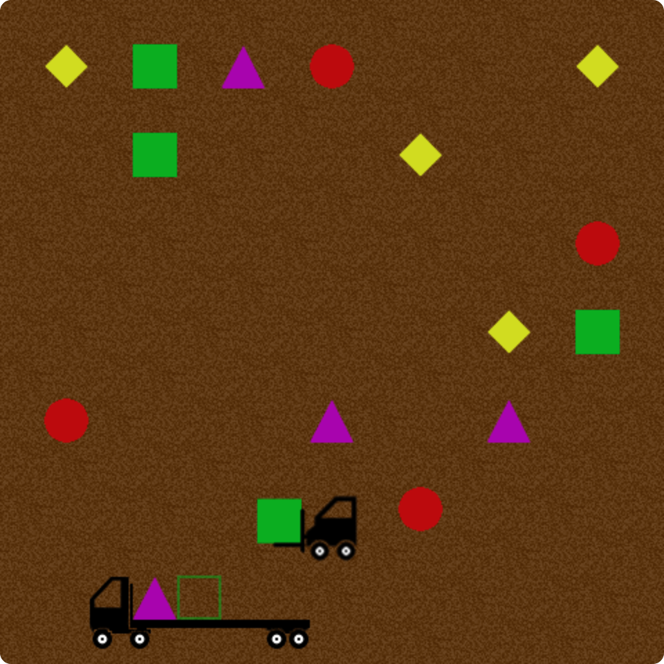

# shape-loader
A simple game for kids where you load shapes onto a truck

## To play: 

You can find it [here](https://jvranish.github.io/shape-loader/).

- Use arrow keys or mouse or touchscreen to move
- The goal is to pick up the right shapes and load them on the truck.

## Have fun!

